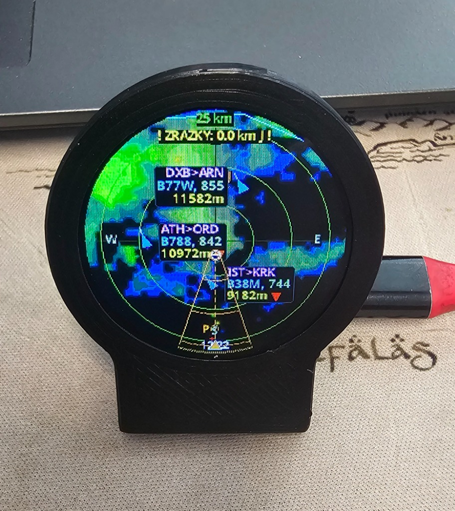
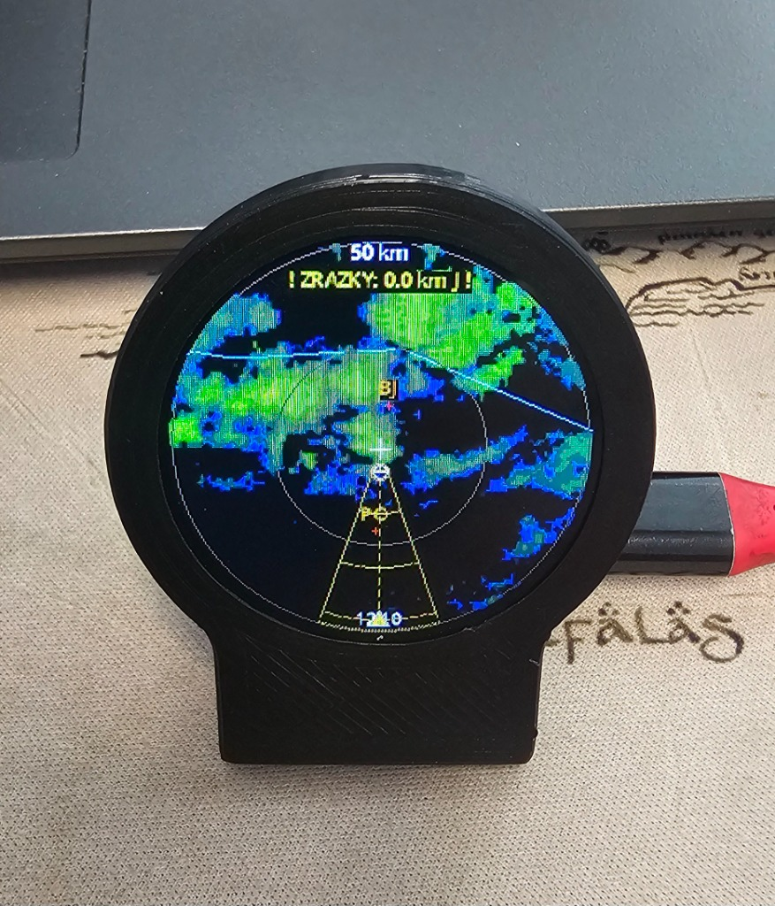
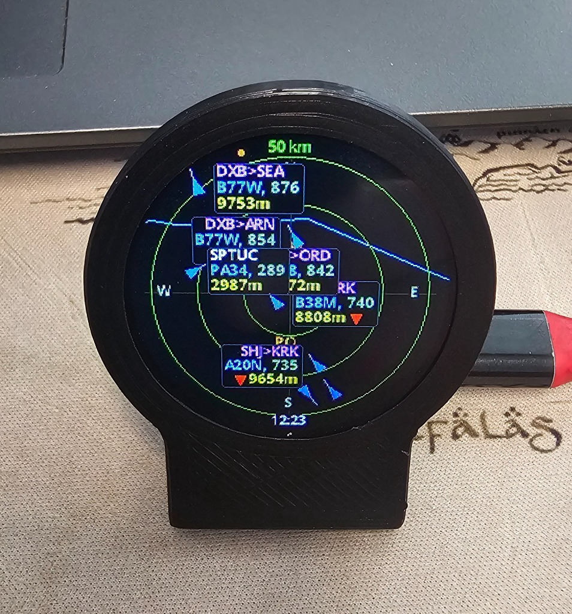
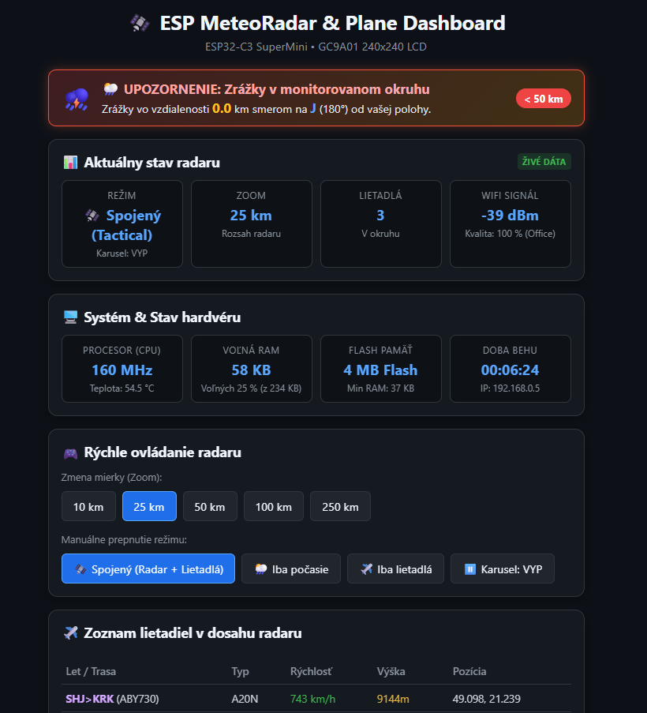

# 🛰️ ESP-GlobalRadar (ESP32-C3 & GC9A01)

<p align="center">
  
  
  
  
  
  
</p>

<p align="center">
  <b>A universal, worldwide tactical radar station for the 1.28″ GC9A01 round LCD display combining global precipitation weather radar (RainViewer API) and live aircraft tracking (ADS-B) with tactical threat sector beam, wind vector analysis, embedded web dashboard, and flicker-free animation.</b>
</p>

---

## 📸 Live Previews

<p align="center">
  
  
  
</p>
<p align="center">
  
</p>

---

## 🌟 Project Overview

**ESP-GlobalRadar** transforms an ultra-compact **ESP32-C3 SuperMini** board and a round **1.28″ GC9A01 TFT display (240×240 px)** into a worldwide tactical radar station. It operates on **any GPS coordinates on Earth** (Europe, Americas, Asia, Africa, Australia).

The device alternates or switches between three primary operational modes via automatic carousel or hardware button clicks:
1. **🛰️ Tactical ATC Combined Radar:** Displays both precipitation clouds and aircraft simultaneously on a single unified tactical screen.
2. **🌍 Global Weather Radar (RainViewer):** Downloads and decodes worldwide precipitation tiles (Web Mercator Slippy Map $256 \times 256\text{ px}$) rendered over real-time international border and coastline vector maps.
3. **✈️ Global ADS-B Aircraft Tracker:** Tracks surrounding flights in real time with continuous position extrapolation (`Dead Reckoning`), airport route lookup (**FROM > TO**), and priority emergency isolation (**Squawk 7700 / 7600 / 7500**).

---

## 🚀 Key Features

* 🌍 **Worldwide Weather Coverage (RainViewer Global HTTPS API):**
  - Web Mercator Slippy Map multi-tile download ($2\times 2$ tile coverage) for any coordinate on Earth.
  - Seamless box interpolation for gap-free precipitation rendering at all zoom levels ($10\text{ km} \dots 250\text{ km}$).
  - Two-stage chunked memory manager avoiding heap fragmentation under TLS.
* 🗺️ **Complete Global Coastlines & Country Boundaries:**
  - Real-time vector rendering of international land borders and ocean coastlines (1,917 segments, 20,520 coordinates from Natural Earth 50m dataset).
  - Detailed coastlines worldwide including the UK Channel, Mediterranean, Scandinavia, islands, and continents.
* 📍 **Curated Regional Cities Database & Custom Home Pin:**
  - 348 regional centers, capitals, and airport hubs in Flash memory.
  - Dynamic user location tag centered on your exact town or custom label (e.g. `Brighton`, `Sliač`, `London`).
* 🧭 **Tactical Threat Sector Beam & Wind Vector Tracking (Open-Meteo 700 hPa):**
  - **Red Pulsating Beam (INCOMING):** Targets incoming storms within the upper-level wind inflow cone ($\pm 60^\circ$ upwind) with alerts such as `! INCOMING: 8.5 km SW !`.
  - **Yellow Tactical Beam (STORM):** Alerts to precipitation within the immediate proximity circle with text `! STORM: 8.5 km SW !`.
  - **Visual Elements:** $36^\circ$ tactical beam, range arc matching the cloud's distance, laser tracer, target reticle, and outer directional chevron ($\blacktriangledown$).
* 🚨 **Exclusive Emergency Flight Focus (Emergency Isolation):**
  - When an aircraft signals an emergency (**Squawk 7700 / 7600 / 7500** or discrete ADS-B flag), **all non-emergency aircraft are instantly hidden**.
  - Only the emergency flight is displayed with a flashing warning outline, persistent HUD tag, and top alert banner `⚠️ EMERGENCY: CALLSIGN (SQ7700)`.
* 🛡️ **Dynamic Aircraft Tag Limiter & Contrast HUD:**
  - Dynamic HUD tag quota prevents display clutter on wide zooms while keeping military and emergency flights prioritized.
  - Translucent rounded contrast boxes ensure 100% legibility over colorful radar storm cores.
  - Automatic callsign-to-airport-route translation (e.g. `VIE>AMS`, `JFK>LHR`, `HND>ITM`).
* ⚡ **Mode-Dependent Power & CPU Throttling:**
  - In *Weather Radar Only* mode, ADS-B network polling is paused, saving power and optimizing responsiveness.
  - When switching modes, aircraft data fetches immediately.
* 🌅 **Astronomical Night Mode (Auto-Dimming):**
  - Automatic sunset/sunrise calculation from GPS coordinates and day of year with automatic backlight dimming.
* 🔘 **Multi-Click Hardware Button (GPIO9):**
  - **Single Click:** Cycle scale ($10 \rightarrow 25 \rightarrow 50 \rightarrow 100 \rightarrow 250\text{ km}$).
  - **Double Click:** Switch mode (Combined $\rightarrow$ Weather Only $\rightarrow$ Aircraft Only).
  - **Long Press (3s):** Factory reset WiFi and NVS memory.
* 🌐 **Embedded Web Dashboard (`http://espglobalradar.local`):**
  - Interactive Leaflet.js map with live aircraft, hardware telemetry, city search, browser GPS location setting, and 1-click OTA firmware updates directly from GitHub.

---

## 🛠️ Hardware & Wiring Diagram

| Component | Description |
| :--- | :--- |
| **ESP32-C3 SuperMini** | Main MCU (RISC-V 160MHz, Wi-Fi 2.4GHz, USB-C) |
| **GC9A01 1.28″ Round LCD** | 240×240 px IPS full-color display (SPI) |
| **Button (BOOT / GPIO9)** | Multi-function button for zoom, modes, and reset |

```
   ESP32-C3 SuperMini                  GC9A01 LCD (240x240)
 +--------------------+               +--------------------+
 |               3.3V |-------------->| VCC & BLK (B-Light)|
 |                GND |-------------->| GND                |
 |              GPIO4 |-------------->| SCL / SCLK (Clock) |
 |              GPIO3 |-------------->| SDA / MOSI (Data)  |
 |              GPIO0 |-------------->| RES / RST (Reset)  |
 |             GPIO10 |-------------->| DC (Data/Command)  |
 |              GPIO1 |-------------->| CS (Chip Select)   |
 +--------------------+               +--------------------+
```

---

## 🚀 Quick Start in 3 Steps

### 1. Flash Firmware (Web Flasher via USB)
1. Open **[web.esphome.io](https://web.esphome.io/)** in Chrome, Edge, or Opera.
2. Connect your ESP32-C3 to your computer via USB-C and click **CONNECT**.
3. Click **Install** and select the downloaded [`merged-firmware.bin`](merged-firmware.bin) file.
4. Once completed, press the **RST** button on the ESP32 board.

### 2. Connect Wi-Fi & Set Location (WiFiManager)
1. On initial boot, connect to the temporary Wi-Fi network: **`ESP-GlobalRadar-Setup`**.
2. In the captive portal (`http://192.168.4.1`):
   - Enter your home Wi-Fi SSID and password.
   - Enter your **GPS Coordinates** (Latitude & Longitude).
   - Set Default Range (e.g. `50` km) and Timezone UTC offset.
3. Click **Save**. The board will connect to Wi-Fi and load live radar data.

### 3. Web Dashboard & Operation
- Access **`http://espglobalradar.local`** (or the device's IP address) from any browser on your local network to view telemetry, interactive map, and settings.

---

## 📦 How to Build from Source (PlatformIO)

```bash
# Clone the repository
git clone https://github.com/hackra76/ESP-GlobalRadar.git
cd ESP-GlobalRadar

# Build and flash via PlatformIO CLI
pio run -t upload
```

---

## 📄 License & Credits

Released under the **[MIT License](LICENSE)**.

Built upon open data feeds and community resources:
- 🌧️ **[RainViewer API](https://www.rainviewer.com/api.html):** Global precipitation weather radar tiles.
- 📡 **[ADSB.fi](https://opendata.adsb.fi/):** Community-driven open ADS-B flight tracking data.
- 🌤️ **[Open-Meteo API](https://open-meteo.com/):** Free global wind vector and weather forecast API.
- 🗺️ **[vrs-standing-data (adsb.lol)](https://vrs-standing-data.adsb.lol/):** Aircraft route database.
- 🖨️ **[3D Case Model (MakerWorld)](https://makerworld.com/cs/models/2872376-esp32-plane-radar-live-ads-b-on-a-round-display):** 3D printable case for the 1.28″ round LCD.
